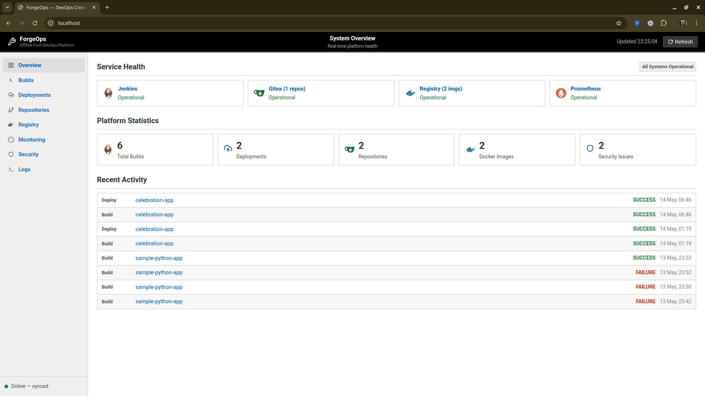
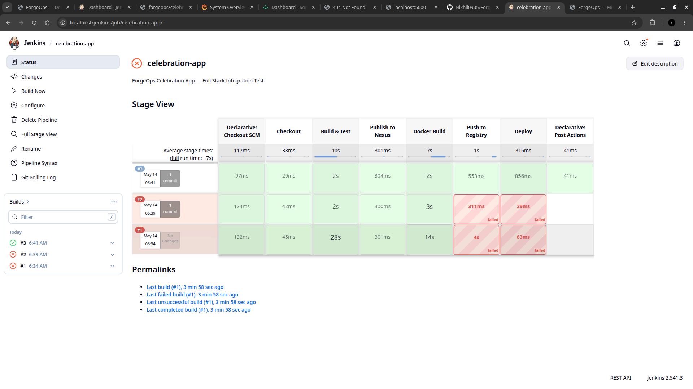
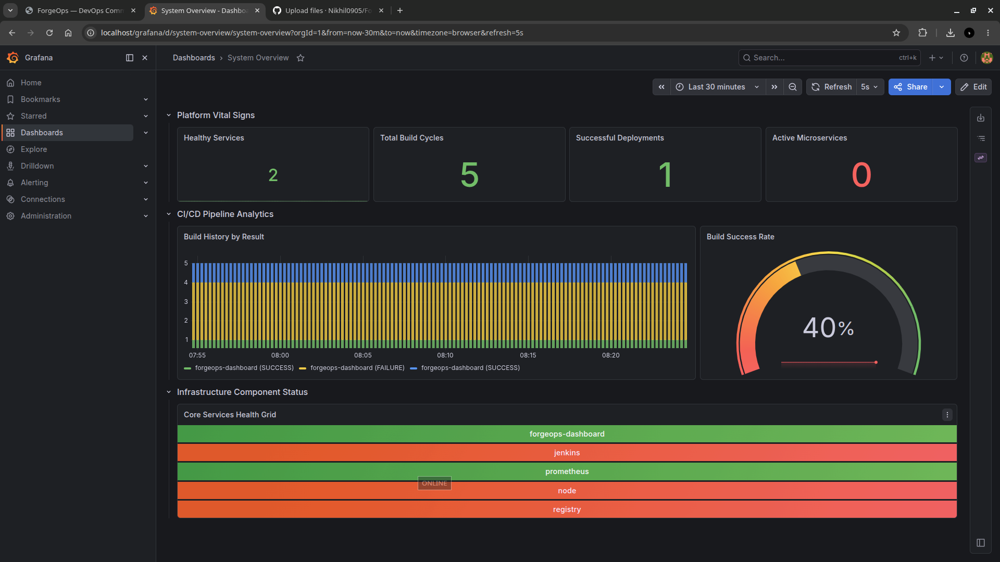
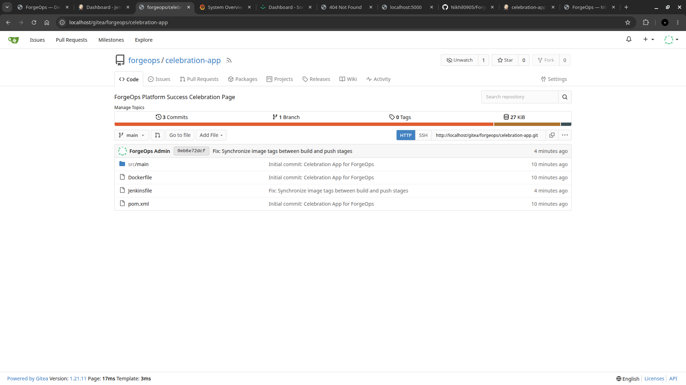
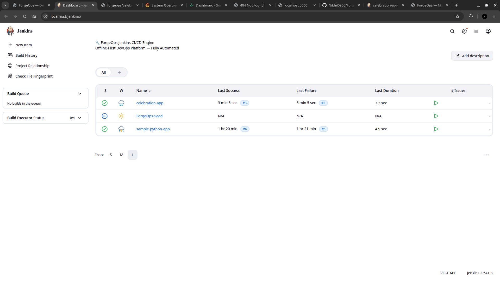
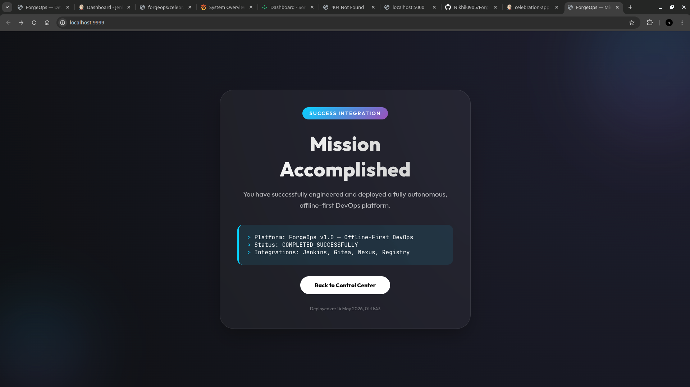

<div align="center">

# ⚙️ ForgeOps

### Offline-First DevOps Platform

**Build. Deploy. Monitor. — Even Without Internet.**

[](https://docs.docker.com/compose/)
[](https://www.jenkins.io/)
[](https://gitea.io/)
[](https://prometheus.io/)
[](https://grafana.com/)

---

*A fully self-hosted, containerized DevOps environment that operates completely offline — with automatic synchronization to GitHub when connectivity is restored.*

</div>

---

## 📸 Platform in Action

### Command Center Dashboard
> Real-time overview of service health, builds, deployments, and activity — all from a single pane of glass.



### Jenkins CI/CD Pipeline — Stage View
> Full multi-stage pipeline with Checkout → Build & Test → Publish to Nexus → Docker Build → Push to Registry → Deploy — all running locally.



### Grafana Monitoring — System Overview
> Real-time CI/CD pipeline analytics, build success rate, and infrastructure component health grid.



### Gitea — Local Git Repository
> Self-hosted Git server with full commit history, branch management, and webhook integration to Jenkins.



### Jenkins Dashboard — Build Overview
> All projects with build history, success/failure status, and executor monitoring.



### Deployed Application — End-to-End Success
> A fully built, tested, and deployed application running live — the complete CI/CD cycle working autonomously.



---

## 🎯 What is ForgeOps?

ForgeOps is a **fully self-contained DevOps platform** that runs entirely offline. It provides Git hosting, CI/CD automation, Docker image management, Maven dependency mirroring, deployment automation, security scanning, and a monitoring dashboard — **all without any cloud dependency**.

When internet connectivity is detected, the **Sync Engine** automatically pushes all local repositories to GitHub as dedicated project branches — enabling code review, collaboration, and backup without manual intervention.

---

## 🔐 Zero-Trust Hardened Security Architecture

To protect internal DevOps workflows in highly secure zones, ForgeOps implements a strict **zero-trust local loopback architecture**:

* **Inner Service Isolation**: Gitea, Jenkins, Nexus, Registry, Prometheus, Grafana, and our custom APIs bind strictly to `127.0.0.1` on the host. They are entirely unexposed to external networks.
* **Unified Secure Gateway**: Nginx serves as the single TLS/SSL-encrypted gatekeeper on ports `80` and `443`.
* **Basic Authentication**: All external page views, API requests, and webhooks are authorized via cryptographic HTTP Basic Auth challenge credentials.

```
[Developer / Client Host]
         │
 (HTTP/HTTPS Port 80/443 + Gateway Basic Auth)
         ▼
 ┌───────────────────────┐
 │ Nginx Reverse Proxy   │ (Edge TLS Termination & Gatekeeper)
 └──────────┬────────────┘
            │
  (Internal Container Net)
            ├──────────────────────┬──────────────────────┬──────────────────────┐
            ▼                      ▼                      ▼                      ▼
    ┌──────────────┐       ┌──────────────┐       ┌──────────────┐       ┌──────────────┐
    │ Dashboard UI │       │  Gitea Git   │       │  Jenkins CI  │       │  Grafana     │
    │  (Port 8888) │       │  (Port 3000) │       │  (Port 8080) │       │  (Port 3001) │
    └──────────────┘       └──────────────┘       └──────────────┘       └──────────────┘
```

---

## 💡 Use Cases

| Scenario | Description |
|----------|-------------|
| **Air-Gapped Environments** | Develop, test, and deploy in networks completely isolated from the internet (defense, classified, edge) |
| **Local Development Labs** | Full-featured DevOps pipeline on a single machine — zero cloud costs |
| **Disaster-Resilient Infra** | Continue deploying autonomously during cloud outages or network partitions |
| **Enterprise Self-Hosting** | Complete data sovereignty — no third-party SaaS dependency |
| **Edge Computing** | Run CI/CD at the edge with intermittent connectivity and auto-sync |

---

## 📦 Services & Host Port Bindings

All internal backends bind strictly to local host loopback interface (`127.0.0.1`) to ensure absolute security and prevent unauthorized bypassing of authentication.

| Container | Image | Local Host Port | Router Gateway URL Path | Role |
|-----------|-------|-----------------|-------------------------|------|
| `forgeops-nginx` | `nginx:1.25-alpine` | `0.0.0.0:80`, `443` | `/` | HTTP/HTTPS Gateway Reverse Proxy |
| `forgeops-gitea` | `gitea/gitea:1.21` | `127.0.0.1:2222` (SSH) | `/gitea/` | Secure Local Git server |
| `forgeops-jenkins` | custom (jenkins/lts) | `127.0.0.1:8080` (HTTP) | `/jenkins/` | CI/CD build engine |
| `forgeops-registry` | `registry:2` | `127.0.0.1:5000` | `/registry/` | Docker image container registry |
| `forgeops-nexus` | `sonatype/nexus3` | `127.0.0.1:8081` | `/nexus/` | Maven dependency mirror registry |
| `forgeops-prometheus` | `prom/prometheus` | `127.0.0.1:9090` | `/prometheus/` | System resource health collector |
| `forgeops-grafana` | `grafana/grafana` | `127.0.0.1:3001` | `/grafana/` | Analytical data dashboard board |
| `forgeops-dashboard-api`| custom (python:3.11)| `127.0.0.1:5050` | `/api/` | Flask core backend REST API |
| `forgeops-dashboard-ui` | custom (nginx) | `127.0.0.1:8888` | `/` | Command center frontend UI |
| `forgeops-sync-engine` | custom (python:3.11)| — (Internal Network) | — | Multi-branch auto-sync manager |

---

## 🚀 Quick Start

Follow these simple commands to provision, secure, and bootstrap the ForgeOps environment:

```bash
# 1. Clone the repository
git clone https://github.com/Nikhil0905/ForgeOps-Offline-First-DevOps-Platform.git
cd ForgeOps-Offline-First-DevOps-Platform

# 2. Configure environment
cp .env.example .env
nano .env    # Update credentials and GitHub PAT

# 3. Generate secure TLS certificates and Gateway passwords
bash scripts/harden-security.sh

# 4. Spin up the orchestrator containers
docker compose up -d

# 5. Bootstrap local Sonatype Nexus caching mirrors
bash services/dependency-mirror/setup-nexus.sh
```

---

## 🔐 Credentials Registry

Use the credentials logged below to log into the platform.

### 🛡️ Outer Gateway Security (HTTP Basic Auth)
All page visits to the Dashboard, Gitea, Jenkins, and Grafana require outer authentication on load:
* **Username**: `admin`
* **Password**: `ForgeOps@2025`

### 💻 Internal Services Login
Once through the secure edge gatekeeper, access individual panels using their local logins:

| Platform Component | Default Username | Default Password | URL Endpoint Path |
|--------------------|------------------|------------------|-------------------|
| **Command Dashboard**| — *(Gateway Only)*| — *(Gateway Only)*| `https://localhost/` |
| **Gitea Git Server** | `forgeops` | `ForgeOps@2025` | `https://localhost/gitea/` |
| **Jenkins CI Engine**| `admin` | `ForgeOps@Jenkins2025`| `https://localhost/jenkins/` |
| **Nexus Mirror**     | `admin` | `ForgeOps@Nexus2025`  | `https://localhost/nexus/` |
| **Grafana Analytics**| `admin` | `ForgeOps@Grafana2025`| `https://localhost/grafana/` |

> ⚠️ Always change passwords in `.env` and rerun `bash scripts/harden-security.sh` prior to high-security production deployments.

---

## 🔄 GitHub Sync Strategy

ForgeOps includes an intelligent **Sync Engine** that bridges offline development with GitHub collaboration:

```
Local Gitea                              GitHub (ForgeOps-Org-repo)
┌──────────────────┐                     ┌──────────────────────────┐
│ celebration-app  │ ──── sync ────────▶ │ branch: projects/        │
│ sample-python-app│ ──── every 60s ───▶ │         celebration-app  │
│ <new-project>    │ ──── auto-create ─▶ │         sample-python-app│
└──────────────────┘                     │         <new-project>    │
                                         └──────────────────────────┘
```

- **Each project** syncs as a dedicated `projects/<name>` branch — never directly to `main`
- **Offline changes** are queued and replayed automatically when connectivity is restored
- **Single PAT** — only needs access to one repository, no broad permissions required
- **Code review enforced** — projects must go through PR review before merging to `main`

---

## 📁 Project Structure

```
forgeops/
├── docker-compose.yml              # Full orchestration (13 services, zero-trust)
├── .env                            # Credentials & configuration
├── .env.example                    # Template for new deployments
│
├── infrastructure/
│   ├── nginx/
│   │   ├── nginx.conf              # Secure edge proxy & gateway rules
│   │   ├── certs/                  # Auto-generated SSL/TLS keys
│   │   └── .htpasswd               # Salty bcrypt user gateway database
│   ├── registry/config.yml         # Docker registry v2 config
│   ├── jenkins/
│   │   ├── Dockerfile              # Jenkins + Docker CLI + Maven
│   │   ├── jenkins.yaml            # JCasC auto-configuration (HTTPS root url)
│   │   └── plugins.txt             # Jenkins plugins
│   ├── gitea/app.ini               # Gitea offline config (SQLite + HTTPS root url)
│   └── monitoring/
│       └── prometheus.yml          # Scrape targets
│
├── services/
│   ├── sync-engine/                # Internet detection + GitHub sync
│   ├── backup-engine/              # Tar-based backup with rotation
│   ├── deployment-engine/          # Pull → run → healthcheck → rollback
│   ├── security-scanner/           # Regex secret scan + image checks
│   └── dependency-mirror/          # Nexus Maven bootstrap
│
├── dashboard/
│   ├── backend/app.py              # Flask REST API (12 endpoints)
│   └── frontend/                   # SPA dashboard (HTML/CSS/JS)
│
├── templates/                      # CI pipeline templates
│   ├── java-maven/Jenkinsfile
│   ├── nodejs/Jenkinsfile
│   └── python/Jenkinsfile
│
├── scripts/
│   ├── install.sh                  # Full bootstrap (run once)
│   ├── healthcheck.sh              # Verify all services (TLS + Auth aware)
│   ├── sync.sh                     # Manual sync trigger
│   ├── rollback.sh                 # Emergency rollback
│   └── harden-security.sh          # Cert & htpasswd credentials generator
│
└── Screenshot_Visuals/             # Platform screenshots
```

---

## 🛠️ Common Commands

```bash
# Start the platform
docker compose up -d

# Stop the platform
docker compose down

# Run the security hardener (regenerate certs and gateway logins)
bash scripts/harden-security.sh

# View logs for a service
docker compose logs -f jenkins

# Run health check
bash scripts/healthcheck.sh

# Manual GitHub sync
bash scripts/sync.sh

# Emergency rollback
bash scripts/rollback.sh <service-name>

# Manual backup
docker exec forgeops-backup-engine /usr/local/bin/backup.sh

# Rebuild a single service
docker compose build dashboard-backend
docker compose up -d --no-deps dashboard-backend
```

---

## 📊 Dashboard API Endpoints

| Method | Path | Description |
|--------|------|-------------|
| GET | `/api/system-health` | Aggregate health of all services |
| GET | `/api/stats` | Summary stats for overview cards |
| GET | `/api/builds` | Jenkins build history |
| POST | `/api/builds/webhook` | Receive Jenkins build events |
| GET | `/api/deployments` | Deployment history |
| POST | `/api/deployments` | Record a deployment event |
| GET | `/api/repositories` | List Gitea repositories |
| GET | `/api/registry/images` | List local Docker images |
| GET | `/api/security-findings` | Security scan results |
| POST | `/api/security-findings` | Record scanner findings |
| GET | `/api/logs` | Combined event log stream |
| GET | `/api/sync-status` | Sync engine queue state |
| GET | `/metrics` | Prometheus metrics endpoint |

---

## 🔮 Future Enhancements

- [ ] AI-powered Jenkins log analysis (failure pattern detection)
- [ ] K3s offline Kubernetes cluster support
- [ ] Multi-node edge deployment
- [ ] USB/portable SSD mode for air-gapped transfers
- [ ] LDAP/SSO authentication integration
- [ ] Trivy offline vulnerability DB bundling
- [ ] Grafana dashboard JSON auto-provisioning

---

<div align="center">

**Built with ❤️ for environments where the internet is a luxury, not a given.**

*ForgeOps — Because your CI/CD pipeline shouldn't depend on someone else's cloud.*

</div>
